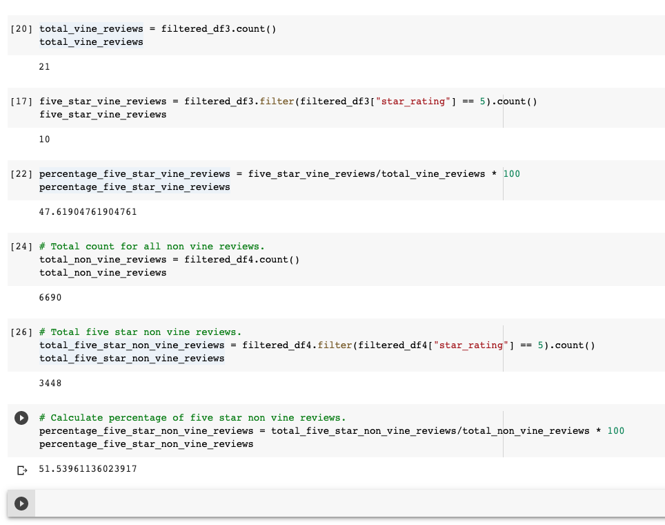

# Amazon_Vine_Analysis

## Overview of the Analysis
The purpose of the analysis was to consider a dataset and use PySpark to perform the ETL process to extract the dataset, transform the data, connect to an AWS RDS instance, and load the transformed data into pgAdmin. Then use PySpark to determine if there is any bias toward favorable reviews from Vine members in the dataset.

From the one dataset, we created multiple tables and dataframes to further analyze. Particularily the reviews and where they came from to ultimately achieve our results.
## Results
How many Vine reviews and non-Vine reviews were there?
- There were a total of 21 total Vine reviews and 6,690 non vine reviews.

How many Vine reviews were 5 stars? How many non-Vine reviews were 5 stars?
- 10/21 Vine reviews were 5 star ratings and 3,448/6,690 non Vine reviews are 5 star ratings.

What percentage of Vine reviews were 5 stars? What percentage of non-Vine reviews were 5 stars?
- 47.6% of Vine reviews were 5 star reviews, and 51.5% non Vine reviews were 5 star reviews.

## Summary
Was there any positivity bias for reviews in the vine program
- I don't think there was any bias within the Vine program, if we look at the review ratios, the non Vine review far exceeded the Vine review count.

An additional recommended analysis would be to use an equally sized dataset either generated randomly
or from more data that we just don't have with this data set.

## Technologies Used
- PySpark
- Google Colaboratory
- AWS S3
- AWS RDS
- SQL
- PgAdmin
- Github
- VS Code